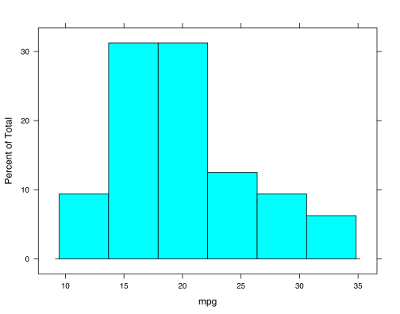
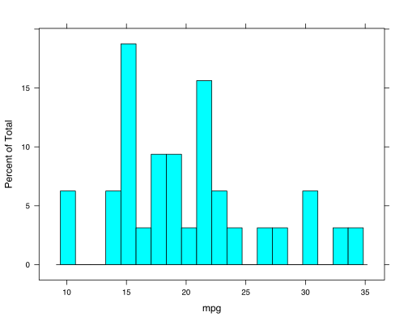
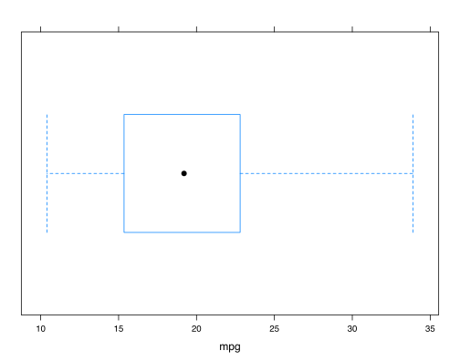
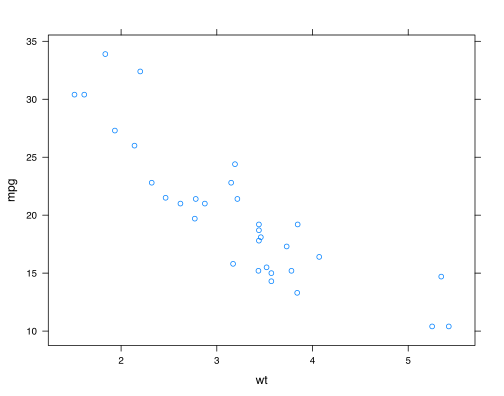
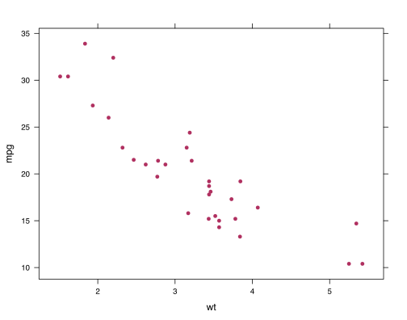
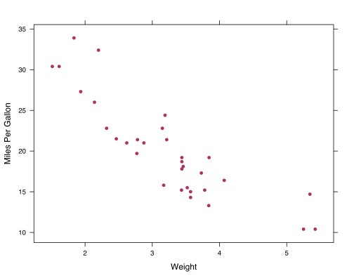
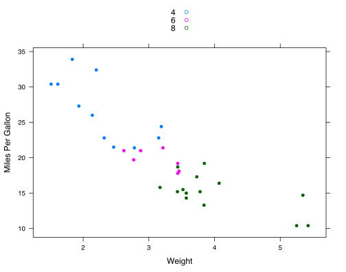
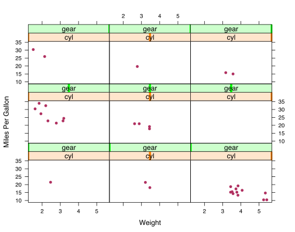

..article: fill

<h1>
  How to Do it with R 
  
    A Tutorial
   
  
    by Ramnath Vaidyanathan
  
</h1>

---

### Overview ###

The objective of this tutorial is to give you a quick overview of how to analyze data with `R`. We will focus our attention on the following topics

1. Data
2. Subset
3. Histogram
4. Boxplot
5. Scatterplot

---

### Data ###

We will work with the built-in data set `mtcars`.

<pre class="knitr">##                    mpg cyl disp  hp drat    wt  qsec vs am gear carb
## Mazda RX4         21.0   6  160 110 3.90 2.620 16.46  0  1    4    4
## Mazda RX4 Wag     21.0   6  160 110 3.90 2.875 17.02  0  1    4    4
## Datsun 710        22.8   4  108  93 3.85 2.320 18.61  1  1    4    1
## Hornet 4 Drive    21.4   6  258 110 3.08 3.215 19.44  1  0    3    1
## Hornet Sportabout 18.7   8  360 175 3.15 3.440 17.02  0  0    3    2
## Valiant           18.1   6  225 105 2.76 3.460 20.22  1  0    3    1
</pre>

You can inspect the data set in many ways. 

<pre class="knitr">View(mtcars)       # view data in rstudio
head(mtcars)       # view first six rows
head(mtcars, 10)   # view first ten rows
tail(mtcars, 20)   # view last twenty rows
NROW(mtcars)       # view number of rows 
NCOL(mtcars)       # view number of columns
dim(mtcars)        # view rows x columns
str(mtcars)        # view structure of data
</pre>

---

### Working with Subsets of Data ###

Very often you might want to work with a smaller subset of the data. `R` makes it very easy to select subsets by combining conditional operations. The main operations are

    == : equal to
    != : not equal to
    >= : greater or equal to
    <= : lesser or equal to
    &  : and
    |  : or
    
Below, you will find these operators applied to choose specific subsets of the `mtcars` data set.

<pre class="knitr">subset(mtcars, gear == 4)           # four gears
subset(mtcars, cyl != 2)            # not 2 cylinders
subset(mtcars, mpg &gt; 20)            # mpg more than 20
subset(mtcars, mpg &gt; 20 &amp; wt &lt; 20)  # mpg &gt; 20 AND wt &lt; 20
subset(mtcars, mpg &gt; 20 | wt &lt; 20)  # mpg &gt; 20 OR wt &lt; 20
</pre>

---

# Plotting with R #

---

### Basics ###

You will need to install the package `lattice` before you can start using it.

<pre class="knitr">install.packages('lattice')
</pre>

Once installed, you need to load the `lattice` package before you start plotting.

<pre class="knitr">require(lattice)
</pre>

If you are interested in economist style of plots, then you need to install the package `latticeExtra` and run the following commands before you start plotting

<pre class="knitr">install.packages('latticeExtra')
require(latticeExtra)
trellis.theme.set(theme = theEconomist.theme(box = 'transparent'))
lattice.options(theEconomist.opts())
</pre>

---

# Histograms #

---

### Basic Histogram ###

<pre class="knitr">histogram(~ mpg, data = mtcars)
</pre>

---

### Control Number of Bins ###

<pre class="knitr">histogram(~ mpg, data = mtcars, nint = 20)
</pre>

---

### Change Color ###

<pre class="knitr">histogram(~ mpg, data = mtcars, col = 'darkred') # see colors() for more
</pre>

---

### Add x-Axis and y-Axis Labels ###

<pre class="knitr">histogram(~ mpg, data = mtcars, xlab = 'Miles per Gallon')
</pre>

---

### Split by Single Categorical Variable ###

<pre class="knitr">histogram(~ mpg | cyl, data = mtcars)
</pre>

---

### Split by Two Categorical Variables ###

<pre class="knitr">histogram(~ mpg | cyl + gear, data = mtcars)
</pre>

---

### Histogram for a Subset of the Data ###

<pre class="knitr">histogram(~ mpg, data = mtcars, subset = (gear == 4))
</pre>

---

### Histograms: Summary ###

Here is a short summary of the commands you have seen on histograms.

<pre class="knitr">hist(~ mpg, data = mtcars)                       # histogram of mpg
hist(~ mpg, data = mtcars, nint = 20)            # 20 bins
hist(~ mpg, data = mtcars, col = 'darkred')      # colored darkred.
hist(~ mpg | cyl, data = mtcars)                 # split by cyl
hist(~ mpg | cyl + gear, data = mtcars)          # split by cyl and gear
hist(~ mpg, data = mtcars, subset = (gear == 4)) # specific subset
</pre>

---

# Box and Whisker Plots #

---

### Simple Boxplot ###

<pre class="knitr">bwplot(~ mpg, data = mtcars)
</pre>

---

### Split by Single Categorical Variable ###

<pre class="knitr">bwplot(~ mpg | cyl, data = mtcars)
</pre>

---

### Side by Side Boxplot ###

The boxplots drawn by `bwplot` are horizontal by default. Hence the `y` axis displays the categorical explanatory variable, while the `x` axis displays the numerical response variable

<pre class="knitr">bwplot(cyl ~ mpg, data = mtcars)
</pre>

---

### Boxplot for a Subset of the Data ###

<pre class="knitr">bwplot(cyl ~ mpg, data = mtcars, subset = (gear == 4))
</pre>

---

# Scatterplots #

---

### Basic Scatterplot ###

<pre class="knitr">xyplot(mpg ~ wt, data = mtcars)
</pre>

---

### Solid Circles as Points ###

<pre class="knitr">xyplot(mpg ~ wt, data = mtcars, pch = 16) # change point shapes using pch
</pre>

---

### Change Color of Points ###

<pre class="knitr">xyplot(mpg ~ wt, data = mtcars, col = 'maroon', pch = 16)
</pre>

---

### Add xAxis and yAxis Labels ###

<pre class="knitr">xyplot(mpg ~ wt, data = mtcars, col = 'maroon', pch = 16,
  xlab = 'Weight', ylab = 'Miles Per Gallon')
</pre>

---

### Color Points by Categorical Variable ###

<pre class="knitr">xyplot(mpg ~ wt, data = mtcars, group = cyl, auto.key = TRUE, pch = 16,
  xlab = 'Weight', ylab = 'Miles Per Gallon')
</pre>

---

### Split by Single Categorical Variable ###

<pre class="knitr">xyplot(mpg ~ wt | cyl, data = mtcars, col = 'maroon', pch = 16,
  xlab = 'Weight', ylab = 'Miles Per Gallon')
</pre>

---

### Split by Multiple Categorical Variable ###

<pre class="knitr">xyplot(mpg ~ wt | cyl + gear, data = mtcars, col = 'maroon', pch = 16,
  xlab = 'Weight', ylab = 'Miles Per Gallon')
</pre>

---

### Scatterplot for a Subset of the Data ###

<pre class="knitr">xyplot(mpg ~ wt, data = mtcars, subset = (cyl == 6))
</pre>

---

# Subset #

---

